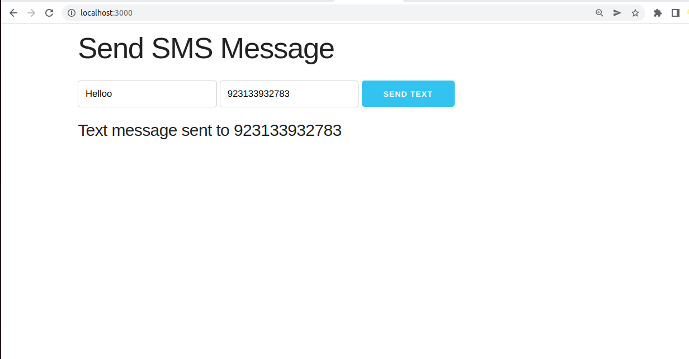

# Text Messaging App
## Nexmo Vonage API

Text Messaging App in Node JS app using Nexmo Vonage Api.

- Node JS / Express 
- Socket.io

## Features

- Use in Mern App.
- ReactNative App use this code


## Installation

Dillinger requires [Node.js](https://nodejs.org/) v10+ to run.

Install the dependencies and devDependencies and start the server.

```sh
File app.js
apiKey: "",
apiSecret: ""
```

```sh
cd sendtextMessageApp
npm i
npm run start
```
